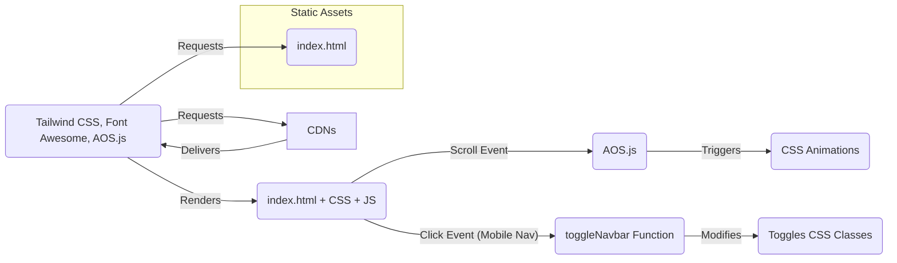

# Architecture Documentation

## 1. System Architecture

This project is a **Static Single-Page Website Template**. Its architecture is entirely client-side, meaning it consists only of static assets (HTML, CSS, JS, potentially images) that are rendered directly in the user's web browser.

- **Client-Side Rendering:** The browser fetches the `index.html` file, parses it, requests linked resources (CSS, JS from CDNs), and renders the page.
- **No Backend:** There is no server-side logic or database involved in the core template. The contact form is non-functional by default.
- **Dependency Management:** External libraries (Tailwind CSS, Font Awesome, AOS.js) are loaded via Content Delivery Networks (CDNs), eliminating the need for local installation or a build process.



_Diagram: Basic interaction flow._

## 2. Project Folder Structure

The project structure is extremely simple, containing only the main HTML file at the root.

```
animated-template/
└── index.html          # The single HTML file containing all structure, content, and styles (via classes)
└── favicon.png         # (Optional but referenced) Favicon for the site
```

_(Note: Assumes `favicon.png` exists as referenced in `index.html`)_

## 3. Major Components

The entire application resides within `index.html`. It can be broken down into the following logical components/sections:

1.  **`<head>` Section:**

    - Metadata (`<meta>` tags for charset, viewport, theme-color).
    - Title (`<title>`).
    - Favicon link (`<link rel="icon">`).
    - CDN Links (`<link>`): Font Awesome CSS, AOS CSS, Tailwind CSS.

2.  **`<body>` Section:**
    - **Navigation (`<nav>`):**
      - Site Title/Logo link.
      - Hamburger menu button (visible on mobile).
      - Navigation links (Social media icons in this case).
      - Uses Tailwind classes for layout and responsiveness.
      - Associated JavaScript (`toggleNavbar`) for mobile menu visibility.
    - **Main Content (`<main>`):** Contains the primary page sections.
      - **Hero/Splash Section:** Full-viewport height section with background image, overlay, title, description, and SVG shape divider. Uses AOS for entry animations.
      - **Services Section:** Features multiple cards (using `div`s styled with Tailwind) describing services/features. Uses AOS for animations. Includes text blocks and image cards.
      - **About Section:** Typically contains an image and descriptive text about the entity/person. Uses AOS animations. Includes SVG shape divider.
      - **Team Section:** Displays team members using card components (image, name, title, social links). Uses AOS animations.
      - **Contact Section (Background):** Dark background section setting up the visual context for the form. Includes marketing points/icons. Uses AOS animations. Includes SVG shape divider.
      - **Contact Form Section:** A visually distinct card overlaying the contact background, containing input fields (`<input>`, `<textarea>`) and a submit button (`<button>`). This form is static. Uses AOS animations.
    - **Footer (`<footer>`):**
      - Contact information/social links.
      - Navigation links (Useful Links, Other Resources).
      - Copyright information.
      - Includes SVG shape divider.
    - **Scripts (`<script>`):**
      - AOS.js library (CDN link).
      - AOS initialization script (`AOS.init({...})`) configuring animation defaults.
      - `toggleNavbar` function for mobile navigation interaction.

## 4. Data Flow

As a static website, there is no dynamic data flow in the traditional sense (like fetching from an API or database). The "flow" is primarily based on user interaction and browser events:

1.  **Page Load:** Browser requests `index.html`, then fetches linked CDN resources. The DOM is parsed and rendered. Styles are applied via Tailwind. AOS initializes.
2.  **User Scroll:** Scrolling the page triggers AOS.js to check element visibility. When an element with `data-aos` attributes enters the viewport, AOS adds CSS classes to trigger the specified animation.
3.  **Mobile Navigation Toggle:** Clicking the hamburger icon triggers the `toggleNavbar` JavaScript function. This function toggles the `hidden`, `block`, and `lg:flex` classes on the navigation menu (`#example-collapse-navbar`) to show/hide it on smaller screens.
4.  **Form Interaction (Static):** Users can type into the form fields, but clicking "Send Message" currently performs no action as there is no submission logic implemented.

## 5. Design Decisions

- **Single HTML File:** Chosen for simplicity and ease of deployment. Ideal for a small landing page or template where minimal complexity is desired.
- **CDN Dependencies:** Reduces setup complexity. No need for package managers (npm/yarn) or build tools (Webpack/Parcel). Makes the template easy for beginners to use. The trade-off is a dependency on external services and potential minor performance hits on initial load if assets aren't cached.
- **Tailwind CSS:** Selected for rapid UI development using utility classes. Enables easy customization and responsiveness without writing custom CSS files. The use of the Tailwind Starter Kit provides pre-styled components as a base.
- **AOS.js:** Incorporated to add visual appeal and engagement through simple, configurable scroll animations without requiring complex JavaScript or CSS keyframe definitions.
- **Vanilla JavaScript:** Used only for essential interactivity (navbar toggle) and library initialization (AOS), keeping the JavaScript footprint minimal and avoiding the need for larger frameworks for this simple use case.
- **Inline SVGs:** Used for decorative polygon shapes between sections, providing visual separation without relying on image files.
